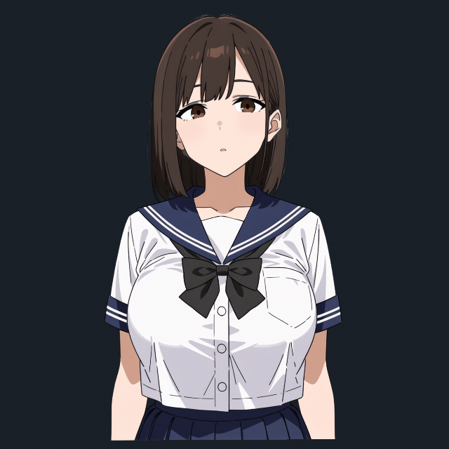

# Anime25D

A Godot 4.7 C# addon that brings layered 2D characters to life. A faithful runtime port of [Anime2.5DRig](https://github.com/852wa/Anime2.5DRig), preserving its original parameters, motion formulas, and default animations.

Features mesh-based head turns, breathing, blinking, mouth animation, hair physics, expression presets, and desktop mouse tracking. Characters are reusable nodes with independent animation state.

PSD conversion runs separately from the runtime. Includes two sample models and an interactive demo.

Code is [MIT licensed](addons/anime25d/LICENSE). Sample artwork belongs to its original authors.
