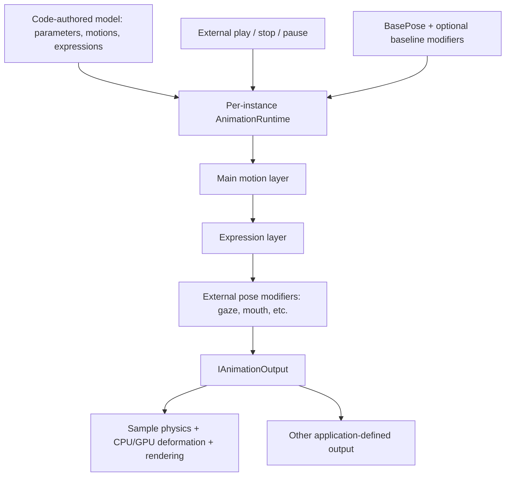

# Animation runtime extraction

> Historical first extraction. The complete model runtime now lives in the addon; see
> [current implementation](MODEL_RUNTIME_IMPLEMENTATION.md). The boundary described below was superseded.

## Boundary

`addons/anime25d/Core` now implements code-authored channel definitions, curves, asset binding,
one motion layer, one expression layer, and per-instance playback. It does not define any character
parts, idle/blink/talk behavior, physics, deformation, shader channels, or animation file format.
`AnimeAnimationNode` is an optional Godot clock adapter.

All original rig implementation files and their Godot UIDs moved to `demo/SampleRig`. Model/profile
resource references, shader includes, offline conversion and shader-binding tools now point there.
The sample registers a baseline controller and a final physics/deformation output with the generic
runtime; its renderer consumes that output in both CPU and GPU modes. Desktop mouse tracking runs
in the post-animation input stage. New sample buttons exercise code-authored motions and independent
expressions. Original preset helpers remain sample-local for numerical reference fixtures.



## Authoring and behavior

See [addon API](../addons/anime25d/README.md) for runnable construction examples, curve interpolation,
playback lifecycle, blend order and extension contracts. See [sample module](../demo/SampleRig/README.md)
for the adapter and compatibility notes. Motion/expression assets are immutable, code-created objects;
all play state is instance-local. No new JSON parsing or file IO was added for animation assets.

The first phase deliberately has no general deformation description language, arbitrary animation
layer graph, queued sequences, automatic idle policy, reverse playback or animation editor. Consumers
can implement custom controllers/output and create definitions directly with curve helpers.

## Validation

Validated locally with Godot 4.7.2 Mono / .NET 10 on macOS Apple M4, Compatibility renderer:

- Original reference: 167 cases, 1,143,442 comparisons. Maximum vertex error 0; maximum parameter
  error 2.22e-16. This checks preservation of the original sample behavior after moving the implementation.
- 47 core animation assertions exercise model-defined IDs, curve interpolation, sharing/isolation, loop
  boundaries and large deltas, speed, pausing, natural completion, replacement and clearing fades,
  expression operations, missing channels, external input/output, callbacks and invalid definitions.
- 188 architecture assertions reject anatomy, sample references and IO in the generic addon, and verify
  that the sample output consumes generic motion/expression values after its own baseline smoothing.
- 218 CPU/GPU image comparisons cover original rendering and new code-authored motion/expression
  transitions. Worst mean channel difference was approximately 0.00119 / 255.
- Independent Godot consumer builds with only the addon and supplies its own polygon output and
  `rotation` parameter. No sample code, shaders or model files are copied.
- 14 rendering captures plus iris-mask, independent-instance and repeated resource cleanup checks pass.
- Demo capture visually inspected; build has zero warnings/errors and generated shader bindings match.

Commands from the repository root (use the installed Godot Mono executable):

```sh
dotnet build --nologo
node tools/reference.cjs
dotnet run --project tests/CoreTests.csproj -- .
node tools/shader-bindings.cjs --check
node tools/verify-consumer.cjs
godot --path . -- --backend-tests
godot --path . -- --render-tests
godot --path . -- --capture-demo
```

Reference data and validation reports are generated under `artifacts/`. The unchanged pinned
JavaScript reference is generated by `tools/reference.cjs`. No results for other rendering platforms
or packaged exports are implied by these checks.
